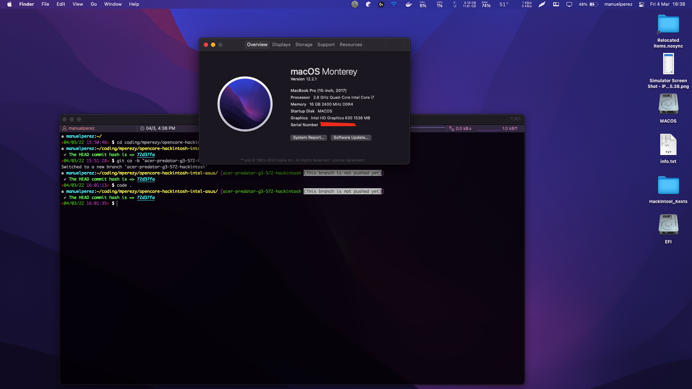
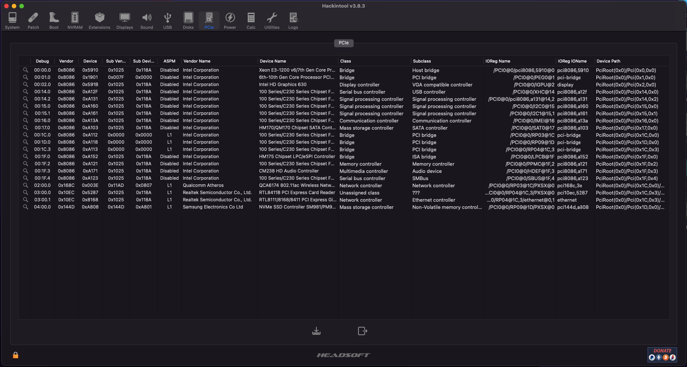
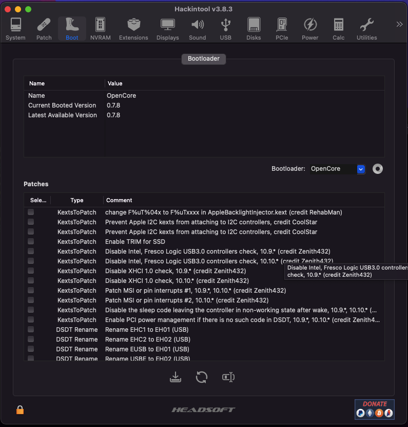

# Opencore Hackintosh in Intel - Acer Predator Helios 300 (2018) Gaming Laptop

# Version in use
* OpenCore 0.7.8

# Introduction
* At first instance I built a [Hackintosh](https://github.com/mperezy/opencore-hackintosh-intel-asus/tree/master) with high-end desktop PC components but given I changed the CPU to an Intel i9-12900K which the iGPU (Intel HD Graphics 770) is not supported by macOS I had to migrate the existing Hackintosh with macOS Monterey installation to a new hardware, in this case to an Acer Predator Helios 300 (2018) Gaming Laptop which the iGPU is supported.

# Table of Contents
* [PC Components](#pc-components)
* [Requirements](#requirements)
* [Kext used in this build](#kext-used-in-this-build)
* [Installation](#installation)
* [What works](#what-works)
* [What's not working](#whats-not-working)
* [WiFi USB adapter installation](#wifi-usb-adapter-installation)
* [Results](#results)

---

## PC components
* | Type | Description |
  | ---- | ----------- |
  | CPU | Intel Core i7-7700HQ |
  | iGPU | Intel UHD 630 Graphics |
  | dGPU | NVIDIA GTX 1060 6GB (disabled) |
  | RAM | DDR4 2 x 8GB @ 2400MHz |
  | SSD | Samsung EVO Plus 500GB SSD M.2 |
  | Display | Laptop's screen 1920x1080 @ 60Hz |

## Requirements
* [OpenCore 0.7.8](https://dortania.github.io/OpenCore-Install-Guide/)
* [Hackintool 3.8.3](https://github.com/headkaze/Hackintool/releases/latest/download/Hackintool.zip)
* [OpenCore Configurator](https://mackie100projects.altervista.org/download-opencore-configurator/)
* [Wireles USB OC Big Sur Adapter Repo](https://github.com/chris1111/Wireless-USB-OC-Big-Sur-Adapter)

## Kext used in this build
* AppleALC
* HoRNDIS (Android USB Hotspot)
* Lilu
* NVMeFix
* RealtekRTL8111
* RtWlanU
* RtWlanU1827
* SMCBatteryManager
* SMCProcessor
* SMCSuperIO
* USBInjectAll
* VirtualSMC
* VoodooI2C
* Voodoo2CHID
* VooddoPS2Controller
* WhateverGreen

## Installation
* This repo contain the files required on `EFI/` folder to install a macOS in the Acer Predator Helios 300 Gaming Laptop (2018), you should copy them in a USB with FAT32 format alongside `com.apple.recovery.boot/` folder.
* In order to get the macOS image installation, please follow this Dortania's [guide](https://dortania.github.io/OpenCore-Install-Guide/installer-guide/#creating-the-usb).
* After install, we'll get **macOS** installed, in my case I got **macOS 10.15 Catalina** and after that I got new updates in order to upgrade a new macOS version, currently Monterey - macOS 12.2.1.

## What works
* Display
* Hardware acceleration (iGPU Intel HD Graphics)
* Keyboard with backlight
* Trackpad with gestures
* Built-in Webcam
* USB Ports - including Type C port
* Wireless Connection with TP-Link T2U Nano USB WiFi dongle
* Ethernet connection - but given my broken eth. port I wsan't able to test it but it is listed using Hackintool.

## What's not working
* Audio - Need to double check it, but it is not required so far
* dGPU NVIDIA GTX 1060 which is unsupported in latest macOS versions
* HDMI output given it works only with NVIDIA dGPU
* SD Card reader

## WiFi USB adapter installation
* There is a repo where a nice guy developed an kernell extension installation in order to be able to get wireless internet connection through a USB adapter.

* To directly download the latest build at the moment, follow the next [link](https://github.com/chris1111/Wireless-USB-OC-Big-Sur-Adapter/files/7834042/Wireless.USB.OC.Big.Sur.Adapter-V12.zip).

    ### SIP SECURITY is enabled - issue

    * If for some reason you got an warning window which mention that the SIP is enabled and the driver installation is not completed, follow the next [link](https://github.com/chris1111/Wireless-USB-OC-Big-Sur-Adapter/discussions/167) to get the steps in order to fix this.

    * IMPORTANT: Go to the link and follow the first step in order to download the Consent program and let the Ketx got installed without issues.

    * Once we followed the first step described above, we must enter to Recovery mode and use the terminal from Utilities tab, for that you must completly shut down the laptop and once the power button is hitted inmediately hold ```Cmd/Win/Super``` + ```Option/Alt``` + ```P``` + ```R``` keys. This will let us get into the Recovery mode.

    * Go to upside and click on ```Utilities > Terminal```, in there we must type: 

    ```shell
    $ csrutil disable
    $ /usr/sbin/spctl kext-consent add ZYM2ETK3E7s  
    ```

    * Then close the terminal and reboot the laptop.

    * Follow the steps in order to install the WiFi USB adapter as the [video](https://youtu.be/roQOmCq0UZw).

    * After that, we must restart the laptop and get into the Recovery mode again in order to re-enable the SIP Security by using the Recovery's utilities terminal and type:

    ```shell
    $ csrutil enable
    ```

## Results



